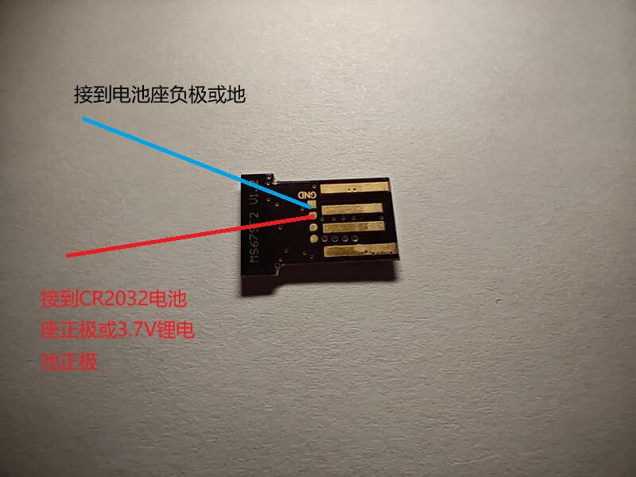

# 迷你版Tag使用说明
## 准备工具

- 电烙铁一个
- 焊锡丝松香若干

## 接线

以下接线方法选其一，推荐3.3v接法

### 3.3V接法（推荐，极致低功耗）

拆开车钥匙或其他电池供电电源，找到电池座或其他电源，注意电压不要超过4V（短时间超没问题，长期不保证稳定性）


背面按图示进行接线，确保正负极不要接反



PCB正面有一个**LDO(低压差线性稳压器)**，即5V转3.3V芯片，用于5V供电场景，如果使用CR2032等3V纽扣电池供电，则不需要，需要拆除以降低功耗
这颗芯片实测存在静态电流(约30μA)，会增加整体功耗并降低续航，建议使用电烙铁拆除（注意芯片特征为5脚，拆除时不要碰歪旁边的电容）。


拆除LDO后模块整体平均电流实测可减低到10μA左右，对于CR2032电池至少使用1年+

### 5V接法（适合锂电池或USB设备供电场景,纽扣电池不推荐）
对于可充电锂电池或其他5V电源供电的场景，对功耗不是过于敏感，可直接接到5V供电点
模块平均电流为40μA，对于需要经常充电的3.7V三元锂电池足够。


## NinjiaTag Web端使用教程

打开浏览器，访问[NinjiaTagPage](https://bd8cca.atomgit.net/NinjiaTagPage/)，建议收藏页面或添加到桌面图标方便访问

## 配置服务器地址
以手机网页端为例，在页面右上角有一个配置服务器按钮，输入你自己部署的数据查询服务 url 地址" 形如 `http://服务器ip:3000/query` 或使用我发给你的服务器地址填入，保存。


## 导入密钥

点击页面左下角“物品管理”按钮，在弹出的对话框中，选择解析JSON密钥文件按钮


在弹出的对话框中，上传.json后缀的密钥文件（这个文件是我提供给你的文件里面的"_devices.json"后缀文件，或者由你自己烧录固件时生成）


上传完成，在对话框最下面选择“确认使用数据”保存密钥

在“物品管理”对话框，点刷新按钮，如果能出现最新更新日期，则说明能正常获取到位置数据。
如果没有获取到或显示空，则需要带着Tag到人流量大的地方走一圈，等待后台数据刷新。

## 选择物品并查询轨迹

点击主页面右下角```数据选择```按钮，在对话框选择物品数据和时间段进行查询，有几个选项：
  
- 轨迹点：历史的轨迹，鼠标悬停或点击可显示详情。

- 热图： 类似地理信息系统的人流密度显示，经常去过的地方颜色更深，不去或偶尔去的地方颜色浅。
  
- 最新位置： 最新的物品位置，以图标的形式显示。

如果没有获取到位置数据，带着diy的NinjiaTag到人流密集的地方走一圈，等待后台服务器获取到位置数据库并存入数据库。


